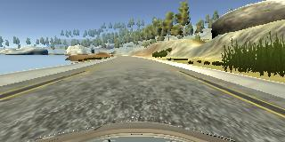
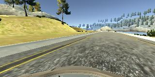
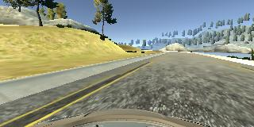
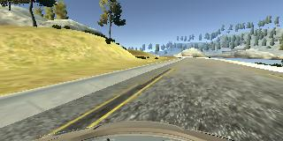
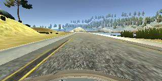
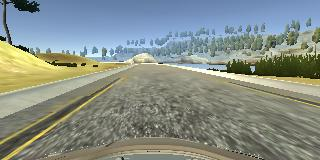
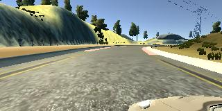
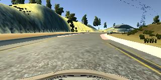
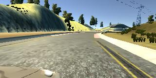
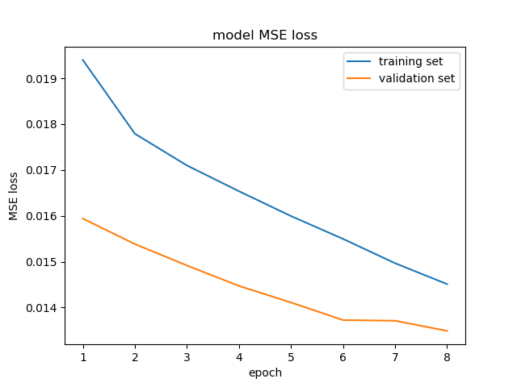

# Behavioral Cloning

## _A project of Self-Driving Car Engineer Nanodegree_

[](http://www.udacity.com/drive)  

### The goals / steps of this project are the following:
* Use the simulator to collect data of good driving behavior
* Build, a convolution neural network in Keras that predicts steering angles from images
* Train and validate the model with a training and validation set
* Test that the model successfully drives around track one without leaving the road

---

In this project, you, as a driver, need to train a neural network to keep a car driving in the center of the lane line. Udacity car simulator ([Windows](https://s3-us-west-1.amazonaws.com/udacity-selfdrivingcar/Term1-Sim/term1-simulator-windows.zip) [Mac](https://s3-us-west-1.amazonaws.com/udacity-selfdrivingcar/Term1-Sim/term1-simulator-mac.zip) [Linux](https://s3-us-west-1.amazonaws.com/udacity-selfdrivingcar/Term1-Sim/term1-simulator-linux.zip)) is used to train the network and test how good the model behave on the road, well of course, in the simulator.

## The model architecture

The model used in this project contains 9 layers, including a normalization layer, 5 convolutional layers, and 3 fully connected layers. It is inspired by a research [paper](http://images.nvidia.com/content/tegra/automotive/images/2016/solutions/pdf/end-to-end-dl-using-px.pdf) published by Nvidia Self-driving Team.

- the normalization layer
  - used to cut off unrelated information from the camera image, such as sky, trees, and car botnet, which will make the model more generalized
  - the reset of the image data is then normalized with zero mean
  - all these helps reduce the size of the model and speed up the training
- the convolutional layers
  - the first 3 layers are processed with 3x3 stride with kernel size 5x5
  - the last 2 layers are processed by a 3x3 kernel with no stride
  - these layers are used to extract features of from the camera image
- the fully connected layers
  - designed to act as control layers to provide steering angle decision according to the features detected from previous convolutional layers
- activation layer
  - ReLu activation is used through out the network to provide non-linearity of the model
  - since this is a regression network, the final output is the steering angle, thus no activation layer is attached
- dropout layer
  - to prevent overfitting, a dropout rate of 0.5 is applied to the output of the first 2 fully connected layers

Here is the Keras network summary:

```
_________________________________________________________________
Layer (type)                 Output Shape              Param #
=================================================================
cropping2d_1 (Cropping2D)    (None, 65, 320, 3)        0
_________________________________________________________________
lambda_1 (Lambda)            (None, 65, 320, 3)        0
_________________________________________________________________
conv2d_1 (Conv2D)            (None, 31, 158, 24)       1824
_________________________________________________________________
conv2d_2 (Conv2D)            (None, 14, 77, 36)        21636
_________________________________________________________________
conv2d_3 (Conv2D)            (None, 5, 37, 48)         43248
_________________________________________________________________
conv2d_4 (Conv2D)            (None, 3, 35, 64)         27712
_________________________________________________________________
conv2d_5 (Conv2D)            (None, 1, 33, 64)         36928
_________________________________________________________________
flatten_1 (Flatten)          (None, 2112)              0
_________________________________________________________________
dense_1 (Dense)              (None, 100)               211300
_________________________________________________________________
dropout_1 (Dropout)          (None, 100)               0
_________________________________________________________________
dense_2 (Dense)              (None, 50)                5050
_________________________________________________________________
dropout_2 (Dropout)          (None, 50)                0
_________________________________________________________________
dense_3 (Dense)              (None, 10)                510
_________________________________________________________________
dense_4 (Dense)              (None, 1)                 11
=================================================================
Total params: 348,219
Trainable params: 348,219
Non-trainable params: 0
_________________________________________________________________
```

As shown above, there are a total of 348,219 parameters to train in the network.

## Model training

The model get trained by observing how you drive. The simulator has two modes: training and autonomous driving. You first drive on the track and capture driving data used for training. Then, the data, the captured images, will be used to train your network.

- collect driving data
  - a total of 51,390 images are collected, and 20% of it are reserved for validation
  - one lap of driving in the center of the lane  
    
  - one lap of driving in the center of lane, but revers direction
  - recovery driving to drive the car from side of the road back onto lane center  
    
    
    
    
    
  - data collected from 3 cameras, e.g. left, center, right, are used   
    
    
    
- data preprocessing
  - all the collect images are left-right flipped to expend the training dataset for more generalized network
  - the camera collected RBG images are converted to YUV color space before sent to the model
  - the sequence of the images can affect the trained model, so, for each epoch of training, the dataset are shuffled randomly to eliminate the affect
- training
  - as the model is trained on my laptop, which only has 4GB GPU memory to use, Python generator is used to keep the memory usage manageable, a batch size of 32 is used here
  - an Adam optimizer is used so that manually training the learning rate wasn't necessary
  - since we are predicting the steering angle, Mean Square Error (MSE) loss is used to determine the model quality

The model converges quite quickly. The validation dataset start to reach <0.015 after 3 epochs.



## Running the project

1. Start the simulator in training mode, and collect driving examples.
   
   Alternertively, you can get a copy of the driving data from this [link](https://d17h27t6h515a5.cloudfront.net/topher/2016/December/584f6edd_data/data.zip). Extract the data in to folder, so that you have the following folder structure:
   ```txt
   data
     |
     |-- IMG
     |    |
     |    |-- *.jpg
     |
     |-- driving_log.csv
   ```
2. Train model
   ```sh
   python model.py
   ```
3. Test model in simulator
   ```sh
   python drive.py model.h5 video
   ```
   Start simulator in autonomous driving mode. The car should start driving by itself. All copy of the driveing footage will be saved in the `video` folder.
4. Generate testing footage
   ```sh
   python video.py video
   ```
   `video.mp4` will be generated.

Here is a sample output from my trained model.

[](https://youtu.be/jrNxl5diAsM)  

Note:
- The first 2 minutes of the video is to test how the car can recovery from the side of the road. You may find the footage is a bit stucky, which is due to I constantly pull the car towards the curbs manually. As shown in the video, when I pull the car to the side of the road in both straight lane and curves, the car can always recovery itself back onto the middle of the lane.
- The rest of the video demonstrated the car can self-drive for the whole lap. It navigate through the curves smoothly and keeps itself in the center of the lane all the time.
